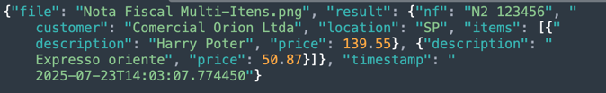

# Automate Invoice Images with Oracle Cloud Vision and Generative AI

## Introduction

Companies often receive thousands of invoices in unstructured formats—scanned images or PDFs—originating from suppliers and service providers. Manually extracting data from these invoices, such as invoice number, customer name, items purchased, and total amount, is a time-consuming and error-prone process.

These delays in processing not only affect accounts payable cycles and cash flow visibility but also introduce bottlenecks in compliance, auditing, and reporting.

This tutorial demonstrates how to implement an automated pipeline that monitors a bucket in Oracle Cloud Infrastructure (OCI) for incoming invoice images, extracts textual content using **OCI Vision**, and then applies **OCI Generative AI** (LLM) to extract structured fiscal data like invoice number, customer, and item list.

---

## Objectives

- Automating invoice ingestion from Object Storage.
- Extracting structured data from semi-structured scanned documents.
- Integrating OCR and LLM in real-time pipelines using OCI AI services.

---

## Oracle Cloud Services Used

| Service                     | Purpose                                                                 |
|----------------------------|-------------------------------------------------------------------------|
| **OCI Vision**             | Performs OCR (Optical Character Recognition) on uploaded invoice images.|
| **OCI Generative AI**      | Extracts structured JSON data from raw OCR text using few-shot prompts. |
| **Object Storage**         | Stores input invoice images and output JSON results.                    |

---

## Prerequisites

1. An OCI account with access to:
    - Vision AI
    - Generative AI
    - Object Storage
2. A Python 3.10 at least
3. A bucket for input images (e.g., `input-bucket`) and another for output files (e.g., `output-bucket`).

---

## Task 1: Configure Python Packages

1. Execute the [requirements.txt](./files/requirements.txt) with:

     
    pip install -r requirements.txt 

2. Run the Python script [main.py](./files/main.py).
3. Upload invoice images (e.g., `.png`, `.jpg`) to your input bucket.
4. Wait for the image to be processed and the extracted JSON saved in the output bucket.

---

## Task 2: Understand the code

### Load Configuration

```python
with open("./config", "r") as f:
    config_data = json.load(f)
```

> Loads all required configuration values such as namespace, bucket names, compartment ID, and LLM endpoint.

Fill the [config](./files/config) with you configuration parameters:
   ```json
   {
     "oci_profile": "DEFAULT",
     "namespace": "your_namespace",
     "input_bucket": "input-bucket",
     "output_bucket": "output-bucket",
     "compartment_id": "ocid1.compartment.oc1..xxxx",
     "llm_endpoint": "https://inference.generativeai.us-chicago-1.oci.oraclecloud.com"
   }
   ```


---

### Initialize OCI Clients

```python
oci_config = oci.config.from_file("~/.oci/config", PROFILE)
object_storage = oci.object_storage.ObjectStorageClient(oci_config)
ai_vision_client = oci.ai_vision.AIServiceVisionClient(oci_config)
```

> Sets up the OCI SDK clients to access Object Storage and AI Vision services. See [OCI Vision Documentation](https://docs.oracle.com/en-us/iaas/tools/python/2.156.0/api/ai_vision/client/oci.ai_vision.AIServiceVisionClient.html)

---

### Initialize LLM

```python
llm = ChatOCIGenAI(
    model_id="meta.llama-3.1-405b-instruct",
    service_endpoint=LLM_ENDPOINT,
    compartment_id=COMPARTMENT_ID,
    auth_profile=PROFILE,
    model_kwargs={"temperature": 0.7, "top_p": 0.75, "max_tokens": 2000},
)
```

> Initializes the OCI Generative AI model for natural language understanding and text-to-structure conversion.

---

### Few-shot Prompt

```python
few_shot_examples = [ ... ]
instruction = """
You are a fiscal data extractor.
...
"""
```

> Uses few-shot learning by providing an example of expected output so the model learns how to extract structured fields like `number of invoice`, `customer`, `location`, and `items`.

---

### OCR with OCI Vision

```python
def perform_ocr(file_name):
   print(f"📄 Performing OCR on: {file_name}")

   response = ai_vision_client.analyze_document(
      analyze_document_details=oci.ai_vision.models.AnalyzeDocumentDetails(
         features=[
            oci.ai_vision.models.DocumentTableDetectionFeature(
               feature_type="TEXT_DETECTION")],
         document=oci.ai_vision.models.ObjectStorageDocumentDetails(
            source="OBJECT_STORAGE",
            namespace_name=NAMESPACE,
            bucket_name=INPUT_BUCKET,
            object_name=file_name),
         compartment_id=COMPARTMENT_ID,
         language="POR",
         document_type="INVOICE")
   )

   print(response.data)

   return response.data
   ```

> This function:
> - Sends the image to OCI Vision.
> - Requests text detection.
> - Returns the extracted raw text.

---

### Data Extraction with LLM

```python
def extract_data_with_llm(ocr_result, file_name):
    # 🔍 Extrai texto OCR (usando a estrutura da resposta do OCI Vision)
    extracted_lines = []
    for page in getattr(ocr_result, 'pages', []):
        for line in getattr(page, 'lines', []):
            extracted_lines.append(line.text.strip())

    plain_text = "\n".join(extracted_lines)

    # 🧠 Monta o prompt com instrução, few-shot e texto OCR limpo
    prompt = instruction + "\n" + "\n".join(few_shot_examples) + f"\nInvoice text:\n{plain_text}\nExtracted fields (JSON format):"

    # 🔗 Chamada ao LLM
    response = llm([HumanMessage(content=prompt)])

    # 🧪 Tenta extrair JSON puro da resposta
    try:
        content = response.content.strip()
        first_brace = content.find("{")
        last_brace = content.rfind("}")
        json_string = content[first_brace:last_brace + 1]
        parsed_json = json.loads(json_string)
    except Exception as e:
        print(f"⚠️ Erro ao extrair JSON da resposta do LLM: {e}")
        parsed_json = {"raw_response": response.content}

    return {
        "file": file_name,
        "result": parsed_json,
        "timestamp": datetime.utcnow().isoformat()
    }
```

> This function:
> - Combines instructions + few-shot example + OCR text.
> - Prepare the OCR data returned by OCI Vision.
> - Sends it to OCI Generative AI.
> - Receives structured JSON fields (as string).
> - OCI Vision supports Portuguese OCR (`language="POR"` can be used instead of `"ENG"`).

---

### Save Output to Object Storage

```python
def save_output(result, file_name):
    ...
```

> Uploads the structured result into the output bucket using the original filename (with `.json` extension).

---

### Main Loop: Monitor and Process

```python
def monitor_bucket():
    ...
```

> Main routine that:
> - Monitors the input bucket every 30 seconds.
> - Detects new `.png`, `.jpg`, `.jpeg` files.
> - Runs OCR + LLM + Upload in sequence.
> - Keeps track of already processed files in memory.

---

### Entry Point

```python
if __name__ == "__main__":
    monitor_bucket()
```

> Starts the bucket watcher and begins processing invoices automatically.

---

## Task 3: Execute the code

Execute the code:

    python main.py

---

## Task 4: Test Suggestions

- Use real or dummy invoices with legible product lines and customer name. Try this [Invoice Multi-Items](./images/Invoice%20Multi-items.png)
- Upload multiple images at the input-bucket in sequence to see automated processing.
- Log into OCI Console > Object Storage to verify results in both buckets.

>**Note:** In this tutorial, the sample used is a Brazilian Invoice to illustrate the complexity of the attributes and disposition and how the prompt were created to resolve this case.


---

## Task 5: View expected output

For each uploaded invoice image:
- Look at the output-bucket file processed. A corresponding `.json` file is generated with structured content like:



---

## 📌 Notes

- OCI Vision supports Portuguese OCR (`language="POR"` can be used instead of `"ENG"`).
- LLM prompt can be adjusted to extract other fields like `CNPJ`, `quantidade`, `data de emissão`, etc.
- Consider persisting `processed_files` with a database or file to make the process fault-tolerant.
- This process can be used with the Use Case: [Build an AI Agent with Multi-Agent Communication Protocol Server for Invoice Resolution](https://docs.oracle.com/en/learn/oci-aiagent-mcp-server/) as a pre-processed Invoice Image. The invoice is a Devolution invoice came from the Company Customer. The fields customer and location are captured from the Invoice creator.

---

## 📚 References

- [OCI Vision Documentation](https://docs.oracle.com/en-us/iaas/tools/python/2.156.0/api/ai_vision/client/oci.ai_vision.AIServiceVisionClient.html)
- [OCI Generative AI Documentation](https://docs.oracle.com/en-us/iaas/Content/generative-ai/home.htm/)
- [LangChain OCI Integration](https://python.langchain.com/docs/integrations/chat/oci_gen_ai/)
- [Build an AI Agent with Multi-Agent Communication Protocol Server for Invoice Resolution](https://docs.oracle.com/en/learn/oci-aiagent-mcp-server/)

## Acknowledgments

- **Author** - Cristiano Hoshikawa (Oracle LAD A-Team Solution Engineer)
